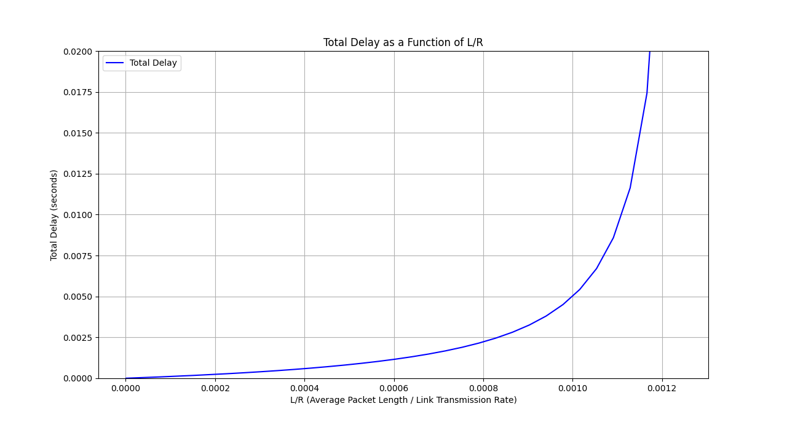

# PROBLEMS
I decide to work on problems which I found interesting and challenging. The full set of problems you can find and check on the textbook. Please buy a digital/hardcover to support the teachers. This solution is for educational purpose only.

## SOLUTIONS 
P2. Equation 1.1 gives a formula for the end-to-end delay of sending one packet
of length L over N links of transmission rate R. Generalize this formula for
sending P such packets back-to-back over the N links
```sh
Equation 1.1: d(end-to-end) = N * L / R
=> Total time to send P packets: P * N * L / R 
```

P3. Consider an application that transmits data at a steady rate (for example, the sender generates an N-bit unit of data every k time units, where k is small and fixed). Also, when such an application starts, it will continue running for a relatively long period of time. Answer the following questions, briefly justifying your answer:
a. Would a packet-switched network or a circuit-switched network be more appropriate for this application? Why?
```sh
Packet-switched network: efficient use of bandwidth, flexible, scalable, lower cost 
Circuit-switched network: guranteed bandwidth, low latency, predictable performance, suitable for real-time communication

Based on two characterisitcs, we can see that with N-bit unit of data every k time units, packet-switchied network would be more suitable. 
```

b. Suppose that a packet-switched network is used and the only traffic in this network comes from such applications as described above. Furthermore, assume that the sum of the application data rates is less than the capacities of each and every link. Is some form of congestion control needed? Why?
```sh
Based on the definition, congestion control is the technique which can prevent the congestion. Congestion can cause a network response time slows down, and the delay increases, leading to retranmissions and worsening the situation. 

It will base on how much it's lesser. If it's lesser just a little bit (or equal just like we see the animation in the course), we still need some forms of congestion control. 

(Hints from google: yes, cause it's essential for network stability, fairness, and predictable performance). 
```

P5. Review the car-caravan analogy in Section 1.4. Assume a propagation speed of 100 km/hour.
a. Suppose the caravan travels 175 km, beginning in front of one tollbooth, passing through a second tollbooth, and finishing just after a third tollbooth. What is the end-to-end delay?
```sh
Processing delay: d(proc)
Queing delay: d(queue)
Tranmission delay: d(trans) = L/R
Propagation delay: d(prop) = d/s (assume s is 2.10^8 m/s)

d(nodal) = d(proc) + d(queue) + d(trans) + d(prop)
         =           2 minutes (120s) + (175 / (2.10^8))
```
b. Repeat (a), now assuming that there are eight cars in the caravan instead of ten.
```sh
Same formula, but instead of 120s, this time is 12 x 8 = 96s + (175 / 2.10^8)
```

P7. In this problem, we consider sending real-time voice from Host A to Host B over a packet-switched network (VoIP). Host A converts analog voice to a digital 64 kbps bit stream on the fly. Host A then groups the bits into 56-byte packets. There is one link between Hosts A and B; its transmission rate is 10 Mbps and its propagation delay is 10 msec. As soon as Host A gathers a packet, it sends it to Host B. As soon as Host B receives an entire packet, it converts the packet’s bits to an analog signal. How much time elapses from the time a bit is created (from the original analog signal at Host A) until the bit is decoded (as part of the analog signal at Host B)?
```sh
Transmission rate is 10 Mbps -> time delay is: packet size in bits / tranmission rate = 64 * 10 ^ 3 / 10 * 10^6 = 0.0064 ms
Propagation delay is 10 ms
Total time d(nodal) = d(trans) + d(prop) = 0.0064 + 10 = 10.0064
```

P8. Suppose users share a 10 Mbps link. Also suppose each user requires 200 kbps when transmitting, but each user transmits only 10 percent of the time. (See the discussion of packet switching versus circuit switching in Section 1.3.)
a. When circuit switching is used, how many users can be supported?
```sh
50 
```

b. For the remainder of this problem, suppose packet switching is used. Find the probability that a given user is transmitting.
```sh
Use binomial distribution, form the wikipedia, we can get:
F(n,k) = (n choose k) * (p^k) * (1 - p)^(n-k) 
```

c. Suppose there are 120 users. Find the probability that at any given time,
exactly n users are transmitting simultaneously. (Hint: Use the binomial
distribution.)
```sh
Each user transmit only 10 percent of the time -> so p = 0.1 and q = 0.9. 
F(120, 50) = (120 choose 50) * (0.1 ^ 50) * (0.9 ^ 70).
```

d. Find the probability that there are 51 or more users transmitting
simultaneously.
```sh
F(120, 51) = (120 choose 51) * (0.1 ^ 51) * (0.9 ^ 69).
```

P10. Consider the network illustrated in Figure 1.16. Assume the two hosts on the left of the figure start transmitting packets of 1500 bytes at the same time towards Router B. Suppose the link rates between the hosts and Router A is 4-Mbps. One link has a 6-ms propagation delay and the other has a 2-ms propagation delay. Will queuing delay occur at Router A?
```sh
R = 4 Mbps -> tranmission delay will be = (1500 bytes * 8) / (4 * 1024) = 12000 / 4 * 10^6 = 3ms 
First one: 6-ms propagation delay -> packet reaches route A at t = tramission delay + propagation delay = 3ms + 6ms = 9ms 
2nd one: 2-ms propagation delay -> packet reaches route A at t = 3m + 2ms = 5ms 

So, the answer is NO. 
```

P14. Consider the queuing delay in a router buffer. Let I denote traffic intensity; that is, I = La/R. Suppose that the queuing delay takes the form IL/R (1 - I) for I < 1.

a. Provide a formula for the total delay, that is, the queuing delay plus the transmission delay.
```sh
Total delay = IL/R (1-I) + L/R = L/(R*(1-I)) 
```

b. Plot the total delay as a function of L/R


P16. Consider a router buffer preceding an outbound link. In this problem, you will use Little’s formula, a famous formula from queuing theory. Let N denote the average number of packets in the buffer plus the packet being transmitted. Let a denote the rate of packets arriving at the link. Let d denote the average total delay (i.e., the queuing delay plus the transmission delay) experienced by a packet. Little’s formula is N = a * d. Suppose that on average, the buffer contains 100 packets, and the average packet queuing delay is 20 msec. The link’s transmission rate is 100 packets/sec. Using Little’s formula, what is the average packet arrival rate, assuming there is no packet loss?
```sh 
Average number of packets in the buffer + packet being transmitted: N
rate of packets arriving in the link: a  
average total delay (queuing + tranmission) by a packet: d 

Little's formual is N = a * d 
buffer: 100 packets 
average packet queuing delay: 20 ms = 0.02s 
Link's tranmission rate: 100 packets/s 

Arrival rate (a) = N / d = 100 / 0.02 
                         = 5000 packets/s 
```

P19. Metcalfe’s law states the value of a computer network is proportional to
the square of the number of connected users of the system. Let n denote the
number of users in a computer network. Assuming each user sends one message to each of the other users, how many messages will be sent? Does your
answer support Metcalfe’s law?
```sh
n is number of users in a computer network, if we send one message to each of them, that would be n * (n-1)  messages. 
```

P20. Consider the throughput example corresponding to Figure 1.20(b). Now suppose that there are M client-server pairs rather than 10. Denote Rs, Rc, and R for the rates of the server links, client links, and network link. Assume all other links have abundant capacity and that there is no other traffic in the network besides the traffic generated by the M client-server pairs. Derive a general expression for throughput in terms of Rs, Rc, R, and M.
```sh
T(pair) = min(Rs, Rc)

All M pairs if there were no bottleneck is M * T(pair)
Total throughput T in the network: T = min(M * min(RS, RC) R)

That possibly means 2 scenarios: 
(1) - If the total of M client-server pairs is less than the rate of network link, the throughput will be limited by the slower of client-server pairs. 
(2) - If the total of M client-server pairs is more than the rate of network link, the throughput will be limited by the network link. 
```

P21. Assume a client and a server can connect through either network (a) or (b) in
Figure 1.19. Assume that Ri = (Rc + Rs) / i, for i = 1, 2, ..., N. In what case
will network (a) have a higher throughput than network (b)?
```sh
The higher throughput should have smaller i, so the network (a) is the answer. 
```

P22. Consider Figure 1.19(b). Suppose that each link between the server and the client has a packet loss probability p, and the packet loss probabilities for these links are independent. What is the probability that a packet (sent by the server) is successfully received by the receiver? If a packet is lost in the path from the server to the client, then the server will re-transmit the packet. On average, how many times will the server re-transmit the packet in order for the client to successfully receive the packet?
```sh
Packet loss is independent, so the probability that a packet send by the server is successfully receved by the receiver is: P(success) = (1-p) ^ (number of packets). 

Using the geometric distribution, we have the probability of success P = (1- p)^n, then the expected number of tranmissions needed to successfully send a packet is 1 / (1- p)^n 

It will tell us on average, how many times it needed for the server re-transmist the packet in order for the client to successfully receive the packet. 
```

P23. Consider Figure 1.19(a). Assume that we know the bottleneck link along the path from the server to the client is the first link with rate Rs bits/sec. Suppose we send a pair of packets back to back from the server to the client, and there is no other traffic on this path. Assume each packet of size L bits, and both links have the same propagation delay dprop.

a. What is the packet inter-arrival time at the destination? That is, how much time elapses from when the last bit of the first packet arrives until the last bit of the second packet arrives?
```
First link: Rs bits/s
each packet: size L bits 
both links: same d(prop)
```
```sh
The first packet time arrival time is: d(trans) + d(prop)
The 2nd packet time start immediately after the first packet: d(trans) + d(trans) + d(prop) = 2d(trans) + d(prop)
Delta(t1) = (t2 - t1) = d(trans) = R/S 
```

b. Now assume that the second link is the bottleneck link (i.e., Rc < Rs). Is
it possible that the second packet queues at the input queue of the second
link? Explain. Now suppose that the server sends the second packet T
seconds after sending the first packet. How large must T be to ensure no
queuing before the second link? Explain.
```sh
It's possible, when the 2nd packet arrives to the queue, the first one still being in the state of transmistting.  

For 2nd question, I have no idea :D 
```