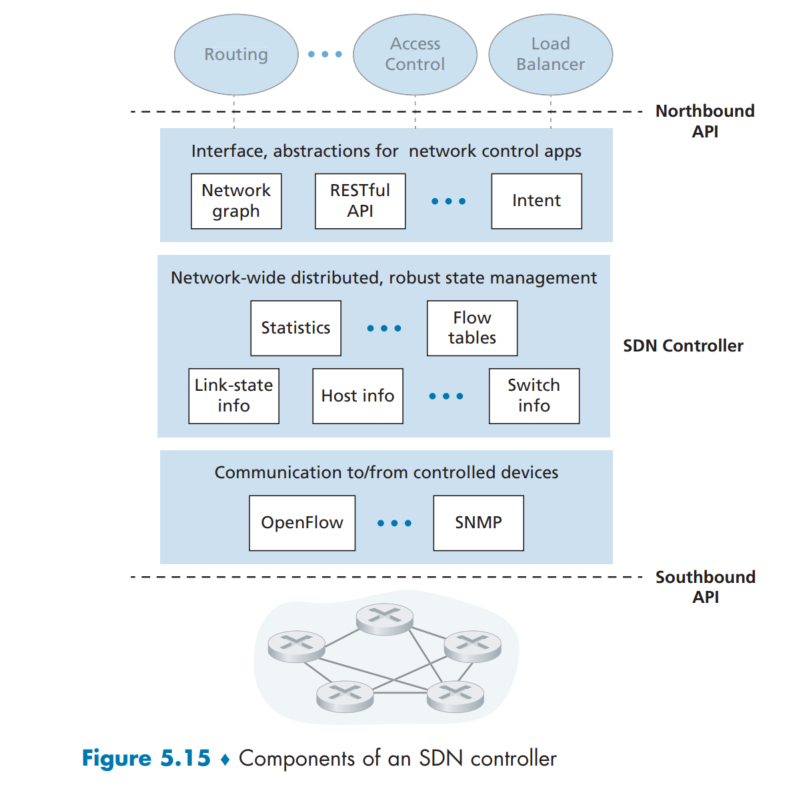

# PROBLEMS
I decide to work on problems which I found interesting and challenging. The full set of problems you can find and check on the textbook. Please buy a digital/hardcover to support the teachers. This solution is for educational purpose only.

## SOLUTIONS 
P1. Suppose the information content of a packet is the bit pattern 1010 0111 0101 1001 and an even parity scheme is being used. What would the value of the field containing the parity bits be for the case of a two-dimensional parity scheme? Your answer should be such that a minimum-length checksum field is used.
```sh
1 0 1 0 | 0
0 1 1 1 | 1 
0 1 0 1 | 0
1 0 0 1 | 0
- - - - - -
0 0 0 1 | 0
```

```sh
1. Calculate the parity for each row:
Row 1: Even parity (1 + 0 + 1 + 0 = 2, which is even)
Row 2: Even parity (0 + 1 + 1 + 1 = 3, which is odd)
Row 3: Even parity (0 + 1 + 0 + 1 = 2, which is even)
Row 4: Even parity (1 + 0 + 0 + 1 = 2, which is even)

2. Calculate the parity for each column:
Column 1: Even parity (1 + 0 + 0 + 1 = 2, which is even)
Column 2: Even parity (0 + 1 + 1 + 0 = 2, which is even)
Column 3: Even parity (1 + 1 + 0 + 0 = 2, which is even)
Column 4: Even parity (0 + 1 + 1 + 1 = 3, which is odd)

3. Then we combie the row and column parities to get the checksum: 0100 0001 0 
```

P2. For the two-dimensional parity check matrix below, show that:
```sh
0 1 0 1 | 0
1 0 1 0 | 0
0 1 0 1 | 0
1 0 1 0 | 0 
- - - - - - 
0 0 0 0 | 0 

```
a. a single-bit error that can be corrected.
```
Assume we change the bit of position (2, 3), then it becomes:
0 1 0 1 | 0
1 0 0 0 | 1
0 1 0 1 | 0
1 0 1 0 | 0 
- - - - - - 
0 0 1 0 | 0 

In this we can see errors in row 2 and column 3 (the sum 1s is not even). 
```

b. a double-bit error that can be detected, but not corrected.
```sh
0 1 0 1 | 0 
1 0 0 0 | 1
0 1 0 0 | 1
1 0 1 0 | 0
- - - - - - 
0 0 1 1 | 0 

In this case, we can detect the error in Row 2, 3 and Column 3, 4. However, these intersect at multiple points: (2, 3), (2, 4), (3, 3), and (3, 4), making it unclear which bits are in error.
```

P3. Suppose the information portion of a packet contains six bytes consisting of the 8-bit unsigned binary ASCII representation of string “CHKSUM”; compute the Internet checksum for this data.
```sh
C -> 67 -> 01000011
H -> 72 -> 01001000
K -> 75 -> 01001011
S -> 83 -> 01010011
U -> 85 -> 01010101
M -> 77 -> 01001101

Sum the ASCII values: 67 + 72 + 75 + 83 + 85 + 77 = 459 -> 11001011 (+1 carry bit) -> 11001100
Then the checksum will be 00110011 
```

P5. Consider the generator, G = 1001, and suppose that D has the value 11000111010. What is the value of R?
```sh
First, we need to append (n(G) = 4 - 1) zeros to data, in this case: 3
So D become -> 11000111010000

Second, use binary divison of the extended data by the generator polynomial G using XOR:
11000111010000 XOR 1001 = 11000111011001
=> this is R(remainder) 
```

P10. Consider two nodes, A and B, that use the slotted ALOHA protocol to contend for a channel. Suppose node A has more data to transmit than node B, and node A’s retransmission probability pA is greater than node B’s retransmission probability, pB.

a. Provide a formula for node A’s average throughput. What is the total efficiency of the protocol with these two nodes?
```sh
node A's average throughput: S(A) = pA * (1-pB) while pA is the probability of node A transmit and B does not transmit 

Same for S(B) = pB * (1- pA)
The total effieciency of the protocol with these two nodes = S(A) + S(B)
```
b. If pA = 2pB, is node A’s average throughput twice as large as that of node B? Why or why not? If not, how can you choose pA and pB to make that happen?
```sh
S(A) = 2pB * (1 - pB) 
S(B) = pB * (1 - pA) = pB * (1 - 2pB)

S(A) / S(B) = 2(1 - pB) / (1 - 2pB) -> so no

pA should equal to pB to make that happen. 
```
c. In general, suppose there are N nodes, among which node A has retransmission probability 2p and all other nodes have retransmission probability p. Provide expressions to compute the average throughputs of node A and of any other node.
```sh
Sum of all other nodes: p(n)
Average throughputs of node A = 2p * (1-p)^(n-1)

Use the same heuristics:
Any other node's: S(other) = p * (1-2p) * (1-p)^(n-2)
```

P11. Suppose four active nodes—nodes A, B, C and D—are competing for access to a channel using slotted ALOHA. Assume each node has an infinite number of packets to send. Each node attempts to transmit in each slot with probability p. The first slot is numbered slot 1, the second slot is numbered slot 2, and so on.

a. What is the probability that node A succeeds for the first time in slot 4?
```sh
The probability that A does not transmit: 1 - p
The probability that at least one node (not including A) transmit: p*(1 - (1 - p)^3) 
Total probability of A fails to transmit successfully in a lot: (1-p) + p*(1-(1-p)^3) = 1-p(1-p)^3
For failing all first 3 slots -> [(1 - p)*(1-p)^3]^3
------------------------------------------------------------
The probability P(A) success in slot 4: P(A) = p * (1-p)^3
----------------------------------------------------
The total is: [(1 - p)*(1-p)^3]^3 * p * (1-p)^3 
```
b. What is the probability that some node (either A, B, C or D) succeeds in slot 5?
```sh
The probability that node A transmit is p
The probability that node B, C and D do not transmit is (1-p)^3
The probability that node A success in slot 5 is p * (1-p)^3
The probability that other node (A, B, C or D) success in slot 5 is 4*p * (1-p)^3
```
c. What is the probability that the first success occurs in slot 4?
```sh
Probability that the first success occurs in last 4:
- No successfull tranmission in slots 1,2, and 3: 
  + No one transmit in a given slot: (1 - p)^4 
  + Collison between more than 2 nodes: 1 - (4p * (1 - p)^3) (while 4p(1-p)^3 is the probability that exactly one node transmit) -> for 3 slots: 1 - (4p*(1-p)^3)^3
  - Exactly one succesfull tranmission in slot 4 -> 4p * (1- p )^3 
---------------------------------------------------
Is the product of both: [1 - (4p*(1-p)^3)^3][4p * (1- p )^3 ]
```
d. What is the efficiency of this four-node system?
```sh
4*p*(1−p)^3
```

P13. Consider a broadcast channel with N nodes and a transmission rate of R bps. Suppose the broadcast channel uses polling (with an additional polling node) for multiple access. Suppose the amount of time from when a node completes transmission until the subsequent node is permitted to transmit (that is, the polling delay) is dpoll. Suppose that within a polling round, a given node is allowed to transmit at most Q bits. What is the maximum throughput of the broadcast channel?
```sh
Throughput (Tmax) is equal to total number of bits in one polling around (1) divided by the total time take for that round (2)

(1) Total number of bits in one polling: N*Q
(2) Time to transfer Q bits -> Q/R seconds 
Total time per node -> Q/R + d(poll) seconds
Total time for all node -> N*(Q/R +d(poll))

Tmax = (1) / (2) = N * Q / N*(Q/R +d(poll)) = QR / (Q + R*d(poll)) 
d(poll) -> 0 
```

P17. Recall that with the CSMA/CD protocol, the network adapter waits K * 512 bit times after a collision, where K is drawn randomly. For K = 115, how long does the adapter wait until returning to Step 2 for:
a. a 10 Mbps broadcast channel?
```sh
1 bit time = 1 / 10*10^6 
Delay for 512 Bit time: 512 * 10^(-7)
Delay total wait time: 512 * 10^(-7) * 115 
```
b. a 100 Mbps broadcast channel?
```sh
Same as #a 
```

P18. Suppose nodes A and B are on the same 12 Mbps broadcast channel, and the propagation delay between the two nodes is 316 bit times. Suppose CSMA/ CD and Ethernet packets are used for this broadcast channel. Suppose node A begins transmitting a frame and, before it finishes, node B begins transmitting a frame. If the answer is yes, then A incorrectly believes that its frame was successful transmitted without a collision. Hint: Suppose at time t = 0 bits, A begins transmitting a frame. In the worst case, A transmits a minimum-sized frame of 512 + 64 bit times. So A would finish transmitting the frame at t = 512 + 64 bit times. Thus, the answer is no, if B’s signal reaches A before bit time t = 512 + 64 bits. In the worst case, when does B’s signal reach A?
```sh
A and B ------ 12 Mbps broadcast channel
propagation delay: 316 bit times 
use: CSMA/CD and Ethernet 
```

```sh
Time for node A to transmitting: (512 + 64) = 576 bit times 
Assume node B starts transmitting at the time of 316 -> so to transmit from B to A will take 316 + 316 = 632 bit times  
So, no. 
```

P19. Suppose nodes A and B are on the same 10 Mbps broadcast channel, and the propagation delay between the two nodes is 245 bit times. Suppose A and B send Ethernet frames at the same time, the frames collide, and then A and B choose different values of K in the CSMA/CD algorithm. Assuming no other nodes are active, can the retransmissions from A and B collide? For our purposes, it suffices to work out the following example. Suppose A and B begin transmission at t = 0 bit times. They both detect collisions at t = 245 t bit times. Suppose KA = 0 and KB = 1. At what time does B schedule its retransmission? At what time does A begin transmission? (Note: The nodes must wait for an idle channel after returning to Step 2—see protocol.) At what time does A’s signal reach B? Does B refrain from transmitting at its scheduled time?
```sh
A and B on: 10 Mbps broadcast channel
A <---> B: 245 bit times 
A <--> B: same time, but the frame collide 

A and B still begin transmissin at t = 0 
detect collision at t = 245 bit times 
kA = 0
kB = 1 

Backoff time can be calculated = K * 512 (where K is a random integer from from [0, 2^n - 1], and n is the number of collision experienced by the node, that means, 1)
Time B schedule its retranmission? -> 512 * 1 = 512 bit times 
Time A schedule its retranmission? -> 512 * 0 = 0 bit times => rretransfer immediately

Time does A's signal reach B? => 245 + 245 = 490 bit times 
Does B refrain from transmistting at is scheduled time? -> yes, 512 + 245 = 757 bit times  
```



P23. Consider Figure 5.15. Suppose that all links are 120 Mbps. What is the maximum total aggregate throughput that can be achieved among 12 hosts (4 in each department) and 2 servers in this network? You can assume that any host or server can send to any other host or server. Why?
```sh
120 x 14 = 1680 Mbps. 
```

P24. Suppose the three departmental switches in Figure 5.15 are replaced by hubs. All links are 120 Mbps. Now answer the questions posed in Problem P23
```sh
The difference between hubs and switches is switches works in layer 2 where it can filter and forward data based on MAC address, and also it can manage multiple simultaneous connections and avoid collisions. 

Meanwhile hubs operate on layer 1 (physical layer) and simply broadcast incoming data to all ports, leading to potential collisions and reduced effective bandwidth.

For instance, in the intra-communication, if it exist the collion in the department, where contains 4 host devices, the 120 Mbps may share among these 4 devices -> Efffective bandwidth of per hub is 120 Mbps / 2 = 60 Mbps, shared among 4 hosts -> 60 / 4 = 15 Mbps / host 

In inter-department and server communication -> bandwdith from each hub -> central switch still 120 Mbps 

Maxmimum will be 120*3 + 3*60 = 540 Mbps 
```