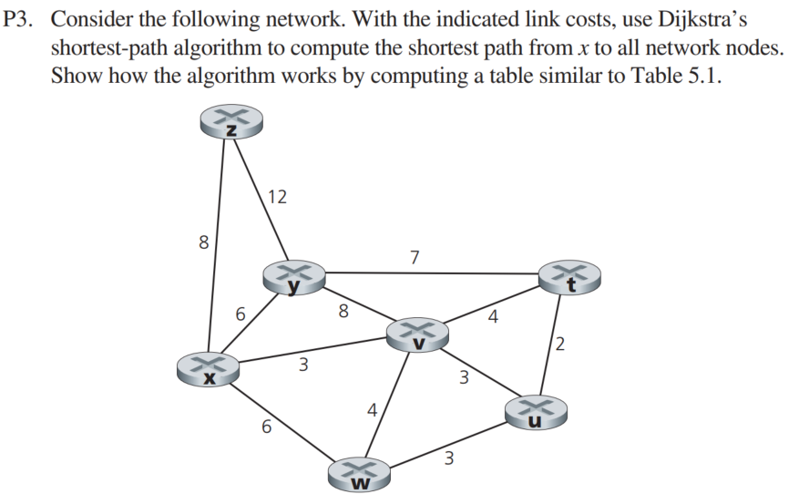

# PROBLEMS
I decide to work on problems which I found interesting and challenging. The full set of problems you can find and check on the textbook. Please buy a digital/hardcover to support the teachers. This solution is for educational purpose only.

## SOLUTIONS 

| step | N' | D(z), p(z) | D(y), p(y)| D(v), p(v)| D(w), p(w)| D(t), p(t) | D(u), p(u) |
|------|----|-------------|-----------|-----------|------------|------------|-----------|
| 0 | x | 8, x | 6, x | 3, x | 6, x | ∞ | ∞
| 1 | xv | 8, x | 6,x |  | 6, x | 7, v | 6, v 
| 2 | xvu | 8, x | 6, x | | 6, x | 6, v | 
| 3 | xvuw | 8, x | 6, x | | | 6, v| | |
| 4 | xvuwt | 8, x | 6, x | | | | | 
| 5 | xvuwty | 8 , x | |  | | | | 
| 6 | xvuwtyz  

