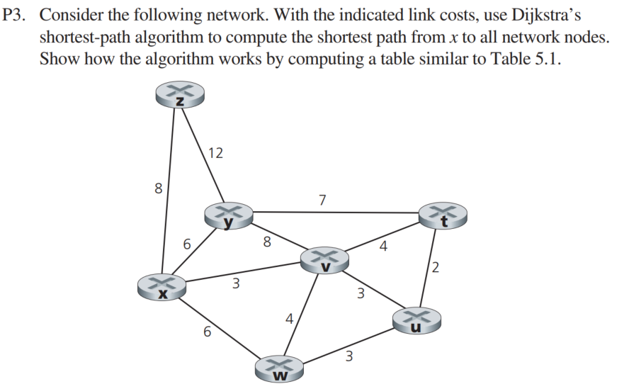
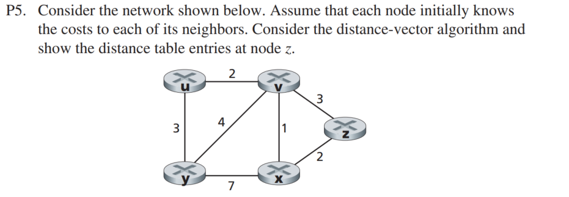
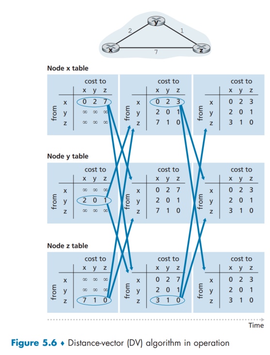
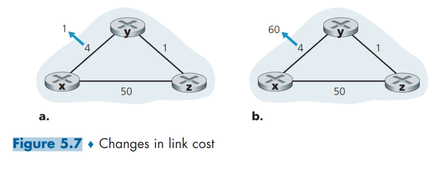
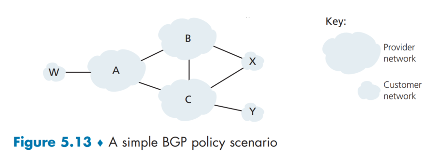

# PROBLEMS
I decide to work on problems which I found interesting and challenging. The full set of problems you can find and check on the textbook. Please buy a digital/hardcover to support the teachers. This solution is for educational purpose only.

## SOLUTIONS 


| step | N' | D(z), p(z) | D(y), p(y)| D(v), p(v)| D(w), p(w)| D(t), p(t) | D(u), p(u) |
|------|----|-------------|-----------|-----------|------------|------------|-----------|
| 0 | x | 8, x | 6, x | 3, x | 6, x | ∞ | ∞
| 1 | xv | 8, x | 6,x |  | 6, x | 7, v | 6, v 
| 2 | xvu | 8, x | 6, x | | 6, x | 6, v | 
| 3 | xvuw | 8, x | 6, x | | | 6, v| | |
| 4 | xvuwt | 8, x | 6, x | | | | | 
| 5 | xvuwty | 8 , x | |  | | | | 
| 6 | xvuwtyz  




Step 0: 
|   | u | v | y | x | z |
|---|---|---|---|---|---|
| u | ∞ | ∞ | ∞ | ∞ | ∞ |
| v | ∞ | 3 | ∞ | ∞ | ∞ |
| y | ∞ | ∞ | ∞ | ∞ | ∞ |
| x | ∞ | ∞ | ∞ | 2 | ∞ |
| z | ∞ | ∞ | ∞ | ∞ | 0 |

Step 1: Distance vector of v: D(v) = {u:2, y:4, x:1, z:3}
Update table using: 
D(z, u) = min()
D(z, y) = 
D(z, x) = 
D(z, v) = 
|   | u | v | y | x | z |
|---|---|---|---|---|---|
| u | ∞ | ∞ | ∞ | ∞ | ∞ |
| v | ∞ | 3 | ∞ | ∞ | ∞ |
| y | ∞ | ∞ | ∞ | ∞ | ∞ |
| x | ∞ | ∞ | ∞ | 2 | ∞ |
| z | ∞ | ∞ | ∞ | ∞ | 0 |

(LATER)

P6. Consider a general topology (that is, not the specific network shown above) and a synchronous version of the distance-vector algorithm. Suppose that at each iteration, a node exchanges its distance vectors with its neighbors and receives their
distance vectors. Assuming that the algorithm begins with each node knowing
only the costs to its immediate neighbors, what is the maximum number of iterations required before the distributed algorithm converges? Justify your answer.
```sh
n nodes -> n - 1 iterations. 
```



P8. Consider the three-node topology shown in Figure 5.6. Rather than having the link costs shown in Figure 5.6, the link costs are c(x,y) = 3, c(y,z) = 6, c(z,x) = 4. Compute the distance tables after the initialization step and after each iteration of a synchronous version of the distance-vector algorithm (as we did in our earlier discussion of Figure 5.6).
```sh
Init table: 

1. Node x table
    x	y	z
x	0	3	4
y	∞	∞	∞
z	∞	∞	∞

1. Node y table
	x	y	z
x	∞	∞	∞
y	3	0	6
z	∞	∞	∞

1. Node z table
	x	y	z
x	∞	∞	∞
y	∞	∞	∞
z	4	6	0
```
```sh
After 1st iteration: 
2. Node x table 
    x	y	z
x	0	3	4
y	3	0	6
z	4	6	0

2. Node y table
	x	y	z
x	0	3	4
y	3	0	6
z	4	6	0

3. Node z table
    x	y	z
x	0	3	4
y	3	0	6
z	4   6   0 		
```

And so on. 


P11. Consider Figure 5.7. Suppose there is another router w, connected to router y and z. The costs of all links are given as follows: c(x,y) = 4, c(x,z) = 50, c(y,w) = 1, c(z,w) = 1, c(y,z) = 3. Suppose that poisoned reverse is used in the distance-vector routing algorithm.

a. When the distance vector routing is stabilized, router w, y, and z inform their distances to x to each other. What distance values do they tell each other?
```sh
The initlizatied distance value (| Dy(x) = 4 | Dz(x) = 7 | Dw(x) = 5)
```
b. Now suppose that the link cost between x and y increases to 60. Will there be a count-to-infinity problem even if poisoned reverse is used? Why or why not? If there is a count-to-infinity problem, then how many iterations are needed for the distance-vector routing to reach a stable state again? Justify your answer.
```sh
No, poisoned reverse is use to prevent a count-to-infinity problem. Because it set the cost of that route to 16. 
```
c. How do you modify c(y,z) such that there is no count-to-infinity problem at all if c(y,x) changes from 4 to 60?
```sh
Also change c(y,z) high enough so that c(y,z) will never be choose as a path after the link cost change e..g, change c(y,z) = 100 
```

P13. Will a BGP router always choose the loop-free route with the shortest ASpath length? Justify your answer
```sh
No, there are others BGP attributes (local preferences, weight,...) and policies (route maps, access lists,...)
```

P14. Consider the network shown below. Suppose AS3 and AS2 are running OSPF for their intra-AS routing protocol. Suppose AS1 and AS4 are running RIP for their intra-AS routing protocol. Suppose eBGP and iBGP are used for the inter-AS routing protocol. Initially suppose there is no physical link between AS2 and AS4.
a. Router 3c learns about prefix x from which routing protocol: OSPF, RIP, eBGP, or iBGP?
```sh
eBGP
```
b. Router 3a learns about x from which routing protocol?
```sh
iBGP/RIP 
```
c. Router 1c learns about x from which routing protocol?
```sh
eBGP
```
d. Router 1d learns about x from which routing protocol?
```sh
RIP
```



P18. Consider Figure 5.13. B would never forward traffic destined to Y via X based on BGP routing. But there are some very popular applications for which data packets go to X first and then flow to Y. Identify one such application, and
describe how data packets follow a path not given by BGP routing.
```sh
CDNs: Content Delivery Network 

CDNs work be store data on multiple server all around the world. When you request a content, CDNs will direct your request to the nearest or most efficient server. 
```

P19. In Figure 5.13, suppose that there is another stub network V that is a customer of ISP A. Suppose that B and C have a peering relationship, and A is a customer of both B and C. Suppose that A would like to have the traffic destined to W to come from B only, and the traffic destined to V from either B or C. How should A advertise its routes to B and C? What AS routes does C receive?
```sh
Looks for AS path prepending
```

P22. In Section 5.7, we saw that it was preferable to transport SNMP messages in unreliable UDP datagrams. Why do you think the designers of SNMP chose UDP rather than TCP as the transport protocol of choice for SNMP?
```sh
SNMP already had a secret code and other options that fits the simplicty, low overhead, and suitability for the lightweight, request-response nature of network management task, and with SNMPv3 it is more secure and flexible, therefore using SNMP and UDP would be a better choice. TCP seems like a heavy option. 
```