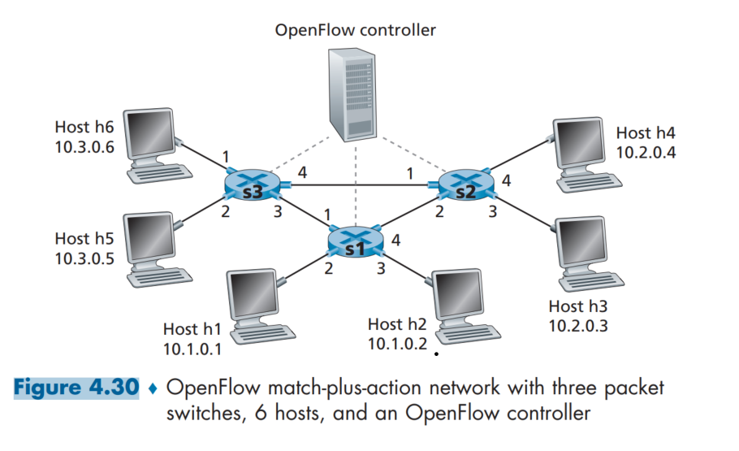

# PROBLEMS
I decide to work on problems which I found interesting and challenging. The full set of problems you can find and check on the textbook. Please buy a digital/hardcover to support the teachers. This solution is for educational purpose only.

## SOLUTIONS 
P1. Consider the network below.
a. Show the forwarding table in router A, such that all traffic destined to host H3 is forwarded through interface 3.
```sh
H1 -> Input RA(1) -> Forward (3) -> RB(1) -> Forward 2 -> RD(1) -> Forward 3
H2 -> Input RA(2) -> Forward (4) -> RC(1) -> Forward 2 -> RD(2) -> Forward 3
or more...  
```
b. Can you write down a forwarding table in router A, such that all traffic from H1 destined to host H3 is forwarded through interface 3, while all traffic from H2 destined to host H3 is forwarded through interface 4? (Hint: This is a trick question.)
```sh
not possible, only do it on destination to determin the following interface, not on the source address. 
```

P2. Suppose two packets arrive to two different input ports of a router at exactly
the same time. Also suppose there are no other packets anywhere in the
router.
a. Suppose the two packets are to be forwarded to two different output ports.
Is it possible to forward the two packets through the switch fabric at the
same time when the fabric uses a shared bus?
```sh
No, shared bus only accept 1 packet at the same time 
```
b. Suppose the two packets are to be forwarded to two different output ports.
Is it possible to forward the two packets through the switch fabric at the
same time when the fabric uses switching via memory?
```sh
Same with #a 
```
c. Suppose the two packets are to be forwarded to the same output port. Is it
possible to forward the two packets through the switch fabric at the same
time when the fabric uses a crossbar?
```sh
Yes, it can be concurrently forwarding. 
```

P4. Consider the switch shown below. Suppose that all datagrams have the same
fixed length, that the switch operates in a slotted, synchronous manner, and
that in one time slot a datagram can be transferred from an input port to an
output port. The switch fabric is a crossbar so that at most one datagram can
be transferred to a given output port in a time slot, but different output ports
can receive datagrams from different input ports in a single time slot. What is
the minimal number of time slots needed to transfer the packets shown from
input ports to their output ports, assuming any input queue scheduling order
you want (i.e., it need not have HOL blocking)? What is the largest number
of slots needed, assuming the worst-case scheduling order you can devise,
assuming that a non-empty input queue is never idle?
```sh
Minimal of time slots need to transfer the packets from input ports to their output ports: 3
Largest number of slots needed (in the worst-case scheduling): 5 
```

P9. Consider a datagram network using 8-bit host addresses. Suppose a router
uses longest prefix matching and has the following forwarding table:

|Prefix Match| Interface|
|------------|-----------|
|00  |0  |
|010 |1  |
|011 |2  |
|10  |3  |
|11  |4  | 
For each of the four interfaces, give the associated range of destination host addresses and the number of addresses in the range.

|Prefix Match|Interface|Binary range|Number of addresses|Decimal range|
|------------|---------|----------|---------------------|-------------|
|00  |0  |00000000 -> 00111111 (6 bits follow the prefix) | 2^6 = 64|0 to 63
|010 |1  |01000000 -> 01011111 (5 bits) | 2^5 = 32| 64 to 95|
|011 |2  |01100000 -> 01111111 (5 bits) | 2^5 = 32| 96 to 127 
|10  |3  | Same (it means you should do it yourself)
|11  |4  | Same

P11. Consider a router that interconnects three subnets: Subnet 1, Subnet 2, and Subnet 3. Suppose all of the interfaces in each of these three subnets are required to have the prefix 223.1.17/24. Also suppose that Subnet 1 is required to support at least 60 interfaces, Subnet 2 is to support at least 90 interfaces, and Subnet 3 is to support at least 12 interfaces. Provide three network addresses (of the form a.b.c.d/x) that satisfy these constraints.
```sh
Subnet 1: 223.1.17.1
Subnet 2: 223.1.17.61
Subnet 3: 223.1.17.152
```

P14. Consider a subnet with prefix 128.119.40.128/26. Give an example of one IP address (of form xxx.xxx.xxx.xxx) that can be assigned to this network.
```sh
Valid address is in: 128.119.40.128 -> 128.119.40.191 (64 bits) including:
- Network address (128.119.40.128)
- Broadcast address (128.119.40.191)
- Range (128.119.40.129 to 128.119.40.190)

Choose any value you want e.g., 128.119.40.166 
```
Suppose an ISP owns the block of addresses of the form 128.119.40.64/26. Suppose it wants to create four subnets from this block, with each block having the same number of IP addresses. What are the prefixes (of form a.b.c.d/x) for the four subnets?
```sh
Divide the block into 4 subnets, we divide 4 -> 64 / 4 = 16 IP addresses per subnet ~ 4 bits
Subnet 1: 128.119.40.64/28
Subnet 2: 128.119.40.80/28
Subnet 3: 128.119.40.96/28
Subnet 4: 128.119.40.112/28
```

P17. Suppose datagrams are limited to 1,500 bytes (including header) between source Host A and destination Host B. Assuming a 20-byte IP header, how many datagrams would be required to send an MP3 consisting of 5 million bytes? Explain how you computed your answer.
```sh
5 mil / (1500 - 20) = 3378 datagrams. 
```

P18. Consider the network setup in Figure 4.25. Suppose that the ISP instead assigns the router the address 24.34.101.225 and that the network address of the home network is 192.168.0/24.
a. Assign addresses to all interfaces in the home network.
```sh
The Router's external interface (WAN) is 24.34.101.225
Router's internal interface (LAN) is 192.168.0.1 (first address)
Network address range is: 129.168.0.2 -> 129.168.255.255 
```
b. Suppose each host has two ongoing TCP connections, all to port 80 at
host 128.119.40.86. Provide the six corresponding entries in the NAT
translation table.
```sh
NAT Table
```

| Internal IP | External IP | Destination IP | 
|-------------|-------------|----------------|
|192.168.0.2:1025|24.34.101.225:4000 (any port value you want)|128.119.40.86:80
|192.168.0.2.1026|24.34.101.225:4001|128.119.40.86:80
|192.168.0.3.1025|24.34.101.225:4002|128.119.40.86:80
|192.168.0.3.1026|24.34.101.225:4003|128.119.40.86:80
|192.168.0.4.1025|24.34.101.225:4004|128.119.40.86:80
|192.168.0.4.1026|24.34.101.225:4005|128.119.40.86:80

P20. In this problem, we’ll explore the impact of NATs on P2P applications.
Suppose a peer with username Arnold discovers through querying that a
peer with username Bernard has a file it wants to download. Also suppose
that Bernard and Arnold are both behind a NAT. Try to devise a technique
that will allow Arnold to establish a TCP connection with Bernard without
application-specific NAT configuration. If you have difficulty devising such
a technique, discuss why
```sh
Use a technique called "Hole punching", basically it's like setting up an immedaitery to connect both Bernard and Arnold. 
```

## Figure 4.30


P21. Consider the SDN OpenFlow network shown in Figure 4.30. Suppose that the desired forwarding behavior for datagrams arriving at s2 is as follows:

• any datagrams arriving on input port 1 from hosts h5 or h6 that are destined to hosts h1 or h2 should be forwarded over output port 2;

| Match | Action |
|-------|--------|
|IP Src = 10.3.0.6; IP Dst = 10.1.0.1 | Forward(3)


• any datagrams arriving on input port 2 from hosts h1 or h2 that are destined to hosts h5 or h6 should be forwarded over output port 1;

| Match | Action |
|-------|--------|
|IP Src = 10.1.0.1; IP Dst = 10.3.0.5 or 10.3.0.6| Forward(1)

• any arriving datagrams on input ports 1 or 2 and destined to hosts h3 or h4
should be delivered to the host specified;
| Match | Action |
|-------|--------|
|IP Src = 10.1.0.1; IP Dst = 10.3.0.5 or 10.3.0.6| Forward(1)

• hosts h3 and h4 should be able to send datagrams to each other. Specify the flow table entries in s2 that implement this forwarding behavior.
| Match | Action |
|-------|--------|
|IP Src = 10.2.0.3 | 10.02.0.4; IP Dst = 10.2.0.4 or 10.2.0.3| Forward(4) | Forward(3) 

(P22 + P23 + P24 is the same problem).

P25. Consider the Internet protocol stack in Figures 1.23 and 4.31. Would you
consider the ICMP protocol to be a network-layer protocol or a transportlayer protocol? Justify your answer.
```sh
IMCP protocol is a protocol for network devices (routers, switches, and hosts) need to convey messages -> network layer protocol. 
```