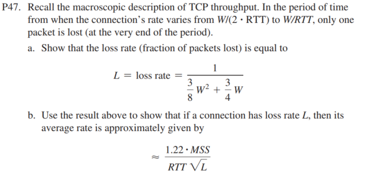

# PROBLEMS
I decide to work on problems which I found interesting and challenging. The full set of problems you can find and check on the textbook. Please buy a digital/hardcover to support the teachers. This solution is for educational purpose only, it's not correct 100% and should be double-checked with your teachers/peers. 

## SOLUTIONS 
P1. Suppose Client A requests a web page from Server S through HTTP and its
socket is associated with port 33000.

a. What are the source and destination ports for the segments sent from A to S?
```sh
Source port: 33000
Destination port: 80 
```

b. What are the source and destination ports for the segments sent from S to A?
```sh
Src port: 80
Dst port: 33000 
```
c. Can Client A contact to Server S using UDP as the transport protocol?
```sh
Yes it can (with QUIC - chapter 2), but still web application is based on TCP
```
d. Can Client A request multiple resources in a single TCP connection?
```sh
Yes, using persistent TCP connection 
```

P4. Assume that a host receives a UDP segment with 01011101 11110010 (we separated the values of each byte with a space for clarity) as the checksum. The host adds the 16-bit words over all necessary fields excluding the checksum and obtains the value 00110010 00001101. Is the segment considered correctly received or not? What does the receiver do?
```sh
Incorrectly so do not receive. Since this is UDP protocol, there is no re-tranmission, therefore it just drops the packet. 
```
P7. In protocol rdt3.0, the ACK packets flowing from the receiver to the
sender do not have sequence numbers (although they do have an ACK field
that contains the sequence number of the packet they are acknowledging).
Why is it that our ACK packets do not require sequence numbers?
```sh
It would be reduntdant since the protocol already contained the ACK field with number in each packet.
```

P11. Consider the rdt2.2 receiver in Figure 3.14, and the creation of a new packet in the self-transition (i.e., the transition from the state back to itself) in the Wait-for-0-from-below and the Wait-for-1-from-below states: sndpkt=make_pkt(ACK,1,checksum) and sndpkt=make_pkt(ACK,0,checksum). Would the protocol work correctly if this action were removed from the self-transition in the Wait-for-1-from-below state? Justify your answer. What if this event were removed from the self-transition in the Wait-for-0-from-below state? 
```sh
I think yes, since we do not need to acknowledge or verify the data is correct or not to the receiver. 

For 2nd question, then there is no tranmission in the 2nd case. 
```

P12. The sender side of rdt3.0 simply ignores (that is, takes no action on) all received packets that are either in error or have the wrong value in the acknum field of an acknowledgment packet. Suppose that in such circumstances, rdt3.0 were simply to retransmit the current data packet. Would the protocol still work? (Hint: Consider what would happen if there were only bit errors; there are no packet losses but premature timeouts can occur. Consider how many times the nth packet is sent, in the limit as n approaches infinity.)
```sh
Yes, the protocol still works. 
If there was only bit errors, it keeps retramistting until the right data is coming. 
The premature timeouts can occurs making this inefficient because it keeps retramissting the current data packet even when it's not necessary. 
```

P13. Assume Host A is streaming a video from Server B using UDP. Also assume that the network suddenly becomes very congested while Host A is seeing the video. Is there any way to handle this situation with UDP? What about with TCP? Is there any other option?
```sh
There is no way to handle the situation. UDP supposed to transmit the data as fast as possible and accepting the packet loss. 

With TCP, it can be re-tranmistted 
Maybe using QUIC or DASH
```

P14. Consider a stop-and-wait data-transfer protocol that provides error checking and retransmissions but uses only negative acknowledgments. Assume
that negative acknowledgments are never corrupted. Would such a protocol
work over a channel with bit errors? What about over a lossy channel with bit
errors?
```sh
Yes, it still can be worked. 
With lossy channel (e.g., packets can be lost when sending NACK), then it will cause a delay because sender must wait for the NACK. This can leads to indefinite time. 
```

P15. Consider the cross-country example shown in Figure 3.17, with a 10 Gbps
link. How big would the window size have to be for the channel utilization to
be greater than 98 percent? Suppose that the size of a packet is 1,500 bytes,
including header fields and data.
```sh
Utilization: U 
R: 10 Gbps 
L: 1500 bytes = 12000 bits

U = (L/R) / RTT + (L/R)
0.98 = (1500 * 8 / (10 * 10^9)) / (RTT + (1500 * 8 / (10 * 10^9)))
=> RTT = (you do the math!) = X 

Window Size = BDP / U where = Y
BDP (Bandwidth-delay Product) = Bandwidth * RTT = 10^10 * X => Window Size = Y / U 
```

P19. Suppose Host A and Host B use a GBN protocol with window size N = 3 and a long-enough range of sequence numbers. Assume Host A sends six application messages to Host B and that all messages are correctly received, except for the first acknowledgment and the fifth data segment. Draw a timing diagram (similar to Figure 3.22), showing the data segments and the acknowledgments sent along with the corresponding sequence and acknowledge numbers, respectively.
```lua
Host A                      Host B
  |                           |
  |--- Seq 0 (0) ------------>|
  |                           |--- (ACK 0 lost) X
  |--- Seq 1 (1) ------------>|
  |                           |<--- ACK 1 --------
  |--- Seq 2 (2) ------------>|
  |                           |<--- ACK 2 --------|
  | (Timeout)                 |
  |--- Seq 0 (0) (Retransmit)-->|
  |                           |<--- ACK 0 --------|
  |--- Seq 3 (3) ------------>|
  |                           |<--- ACK 3 -------->|
  |--- Seq 4 (4) ------------>|
  | (Seq 4 lost)              |--- (ACK 4 not sent)
  |--- Seq 5 (5) ------------>|
  |                           |
  | (Timeout for Seq 4)       |
  |--- Seq 4 (4) (Retransmit)-->|
  |                           |<--- ACK 4 --------|
  |--- Seq 5 (5) ------------>|
  |                           |<--- ACK 5 --------|

```

P20. Consider a scenario in which Host A and Host B want to send messages to
Host C. Hosts A and C are connected by a channel that can lose and corrupt
(but not reorder) messages. Hosts B and C are connected by another channel
(independent of the channel connecting A and C) with the same properties.
The transport layer at Host C should alternate in delivering messages from
A and B to the layer above (that is, it should first deliver the data from a packet
from A, then the data from a packet from B, and so on). Design a stop-andwait-like error-control protocol for reliably transferring packets from A and
B to C, with alternating delivery at C as described above. Give FSM descriptions of A and C. (Hint: The FSM for B should be essentially the same as
for A.) Also, give a description of the packet format(s) used
```lua
Host A                 Host C                 Host B 
   |                    |                       |
   |--- Seq 0 (0)---->  |                       |
   |<-- ACK 0 -------   |                       |
   |                    |<----- Seq 0 (0) ----  |
   |                    |------- ACK 0 (0)--->  |
   |---- Seq 1 (1)--->  |---- (ACK 1 not send)  |                           
   |                    |<----- Seq 1 (1) ----  | 
   |                    |----- ACK 1 (1) ---->  |
   | (Timeout)          |                       |
   |---- Seq 1 (1) retr |<----- ACK 1 (1) ---->
```

P22. Consider the GBN protocol with a sender window size of 4 and a sequence number range of 1,024. Suppose that at time t, the next in-order packet that the receiver is expecting has a sequence number of k. Assume that the medium does not reorder messages. Answer the following questions:

a. What are the possible sets of sequence numbers inside the sender’s window at time t? Justify your answer.
```sh
{k, k+1, k+2, k+3}
```
b. What are all possible values of the ACK field in all possible messages currently propagating back to the sender at time t? Justify your answer.
```sh
We don't have the re-tranmission, so the best we can get is all 4 ACK. 
```

P23. Give one example where buffering out-of-order segments would significantly
improve the throughput of a GBN protocol.
```sh
GBN will not send the ACK if one of the packets (e.g., packet 1 lost), then it will add the unneccsary re-tranmission without buffering. 
```

P24. Consider a scenario where the three hosts A, B, and C are connected as a ring: A to B, B to C, and C to A. Assume that A and C run protocol rdt3.0, whereas B simply relays all messages received from A to C.

a. Does this arrangement enable reliable delivery of messages from A to C?
```sh
No this doesn't since B do not have any mechanism to prevent the loss or send the message correctly 
```
b. Can B tell if a certain message has been correctly received by A?
```sh
No. 
```

P26. Consider transferring an enormous file of L bytes from Host A to Host B. Assume an MSS of 536 bytes.

a. What is the maximum value of L such that TCP sequence numbers are not exhausted? Recall that the TCP sequence number field has 4 bytes.
```sh
The sequence number field is 32 bits long, therfore to calculate the maximum value of L: 2^32 * 4 
```
b. For the L you obtain in (a), find how long it takes to transmit the file. Assume that a total of 66 bytes of transport, network, and data-link header are added to each segment before the resulting packet is sent out over a 155 Mbps link. Ignore flow control and congestion control so A can pump out the segments back to back and continuously.
```sh
Total numbr of packets in size is: 536 + 66 = 602 * 8 = 4816 bits 
Time per packet = 4816 / 155 * 10^6 = X seconds 
Number of packets: 2^32 * 4 / 536 = Y packets 
Time total = X * Y 
```

P27. Host A and B are communicating over a TCP connection following RFC 5681. Host B has already received from A all bytes up through byte 96. Suppose Host A then sends two segments to Host B back-to-back. The first segment and the second segments contain 40 and 80 bytes of data, respectively. In the first segment, the sequence number is 97, the source port number is 302, and the destination port number is 80. Host B sends an acknowledgment whenever it receives a segment from Host A.

a. In the second segment sent from Host A to B, what are the sequence number, source port number, and destination port number?
```sh
Sequence number: 137
Src port number: 302
Des port number: 80 
```
b. If the first segment arrives before the second segment, in the acknowledgment of the first arriving segment, what is the acknowledgment number, the source port number, and the destination port number?
```sh
Acknowledgment number: 137 
Src port number: 80 
Des port number: 302
```
c. If the second segment arrives before the first segment, in the acknowledgment of the first arriving segment, what is the acknowledgment number?
```sh
Acknowledgement number: 97
```
d. Suppose the two segments sent by A arrive in order at B. The first acknowledgment arrives after the first timeout interval. What is the sequence number of the next segment that A will transmit?
```sh
Sequence number: 137 (re-send the first segment due to the timeout)
```

P29. SYN cookies were discussed in Section 3.5.6.
a. Why is it necessary for the server to use a special initial sequence number in the SYNACK?
```sh
To verify and to make sure that the server do not contain the flood attacks 
```
b. Suppose an attacker knows that a target host uses SYN cookies. Can the attacker create half-open or fully open connections by simply sending an ACK packet to the target? Why or why not?
```sh
No, because when server create the SYN cookie, it will contain the sequence number, all the information, and hash cryptography. Therefore, it would be impossible for the attacker create half-open or fully open connections. 
```
c. Suppose an attacker collects a large amount of initial sequence numbers sent
by the server. Can the attacker cause the server to create many fully open
connections by sending ACKs with those initial sequence numbers? Why?
```sh
No, see #b 
```

P31. Suppose that the five measured SampleRTT values (see Section 3.5.3) are 112 ms, 140 ms, 110 ms, 90 ms, and 90 ms. 

Compute the EstimatedRTT after each of these SampleRTT values is obtained, using a value of α = 0.125 and assuming that the value of EstimatedRTT was 120 ms just before the first of these five samples were obtained. 
```sh
EstimatedRTT = (1 – α) * EstimatedRTT + α * SampleRTT
112 -> 119.0 
140 -> 121.625 
110 -> 120.171875
90 -> 116.400390625
```

Compute also the DevRTT after each sample is obtained, assuming a value of b = 0.25 and assuming the value of DevRTT was 6 ms just before the first of these five samples was obtained.
```sh
DevRTT = (1 – β) * DevRTT + β * | SampleRTT – EstimatedRTT |

You do the math

```
Finally, compute the TCP TimeoutInterval after each of these samples is obtained
```sh
TimeoutInterval = EstimatedRTT + 4 * DevRTT 
```

P37. Compare GBN, SR, and TCP (no delayed ACK). Assume that the timeout values for all three protocols are sufficiently long such that five consecutive data segments and their corresponding ACKs can be received (if not lost in the channel) by the receiving host (Host B) and the sending host (Host A) respectively. Suppose Host A sends five data segments to Host B, and the second segment (sent from A) is lost. In the end, all five data segments have been correctly received by Host B.

a. How many segments has Host A sent in total and how many ACKs has Host B sent in total? What are their sequence numbers? Answer this question for all three protocols.
```sh
GBN:
 - Segments sent by host A: 9 (1, 2, 3, 4, 5 then 2, 3, 4, 5)
 - ACKs sent by host B:  5 (ACK2, ACK3, ACK4, ACK5, ACK6)

SR:
 - Segments sent by host A: 6 (1, 2, 3, 4, 5 then 2)
 - ACKs sent by host B: 5 (ACK3, ACK4, ACK5, ACK6, ACK2)

TCP:
 - Segments sent by host A: 6 (1, 2, 3, 4, 5, then 2)
 - ACKs sent by host B: 8 (ACK 2 initially, 3 duplicate ACKs (ACK2) for segments 3, 4,5, and ACK 6 after re-tranmission)
```
b. If the timeout values for all three protocol are much longer than 5 RTT,
then which protocol successfully delivers all five data segments in shortest time interval?
```sh
Should be SR if we summarize the ACKs sent and the segments sent, no? 
```

P40. Consider Figure 3.61. Assuming TCP Reno is the protocol experiencing the behavior shown above, answer the following questions. In all cases, you should provide a short discussion justifying your answer.
a. Identify the intervals of time when TCP slow start is operating.
```sh
Round 1 to round 6. The congestion window (cwnd) grows rapidly from 1 segment to 32 segments, appx. 
```
b. Identify the intervals of time when TCP congestion avoidance is operating.
```sh
Round 7 to round 16 
```
c. After the 16th transmission round, is segment loss detected by a triple
duplicate ACK or by a timeout?
```sh
Triple duplicate ACK -> trigger a fast retransmit and fast recovery in TCP Reno 
```
d. After the 22nd transmission round, is segment loss detected by a triple
duplicate ACK or by a timeout?
```sh
Timeout -> the cwnd reset to 1 as per the behavior of the TCP Reno 
```
e. What is the initial value of ssthresh at the first transmission round?
```sh
Cwnd / 2 ~ Around 22 or 23 
```
f. What is the value of ssthresh at the 22nd transmission round?
```sh
Reset to 1 
```
g. During what transmission round is the 70th segment sent?
```sh
Round 7 
```
h. Assuming a packet loss is detected after the 26th round by the receipt of
a triple duplicate ACK, what will be the values of the congestion window
size and of ssthresh?
```sh
ssthresh: 7 or 8 / 2 = 4 
window size cwnd: 4 + 3 (ACK) = 7 
```
i. Suppose TCP Tahoe is used (instead of TCP Reno), and assume that triple
duplicate ACKs are received at the 10th round. What are the ssthresh
and the congestion window size at the 11th round?
```sh
ssthresh: 38 / 2 = 19 
cwnd: 1 (set cwnd to 1 segment for Tahoe at the 11th round)
```
j. Again, suppose TCP Tahoe is used, and there is a timeout event at the 22nd
round. How many packets have been sent out from the 17th round till the
22nd round, inclusive?
```sh
R17: cwnd = 20
R18: cwnd = 21
R19: cwnd = 22 
R20: cwnd = 23
R21: cwnd = 1 
R22: cwnd = 2

Total packets sent = 20 + 21 + 22 + 23 + 1 + 2 = 89 packets
```

P43. Host A is sending an enormous file to Host B over a TCP connection. Over
this connection there is never any packet loss and the timers never expire.
Denote the transmission rate of the link connecting Host A to the Internet by
R bps. Suppose that the process in Host A is capable of sending data into its
TCP socket at a rate S bps, where S = 10 * R. Further suppose that the TCP
receive buffer is large enough to hold the entire file, and the send buffer can
hold only one percent of the file. What would prevent the process in Host
A from continuously passing data to its TCP socket at rate S bps? TCP flow
control? TCP congestion control? Or something else? Elaborate.
```
Transmission rate: R bps
A send data through socket S = 10 * R 
TCP receive buffer: 1%F 

Then it would be TCP congestion control because:
1. The TCP receive buffer is large enough to hold the entire file 
2. The speed of sending data is fast, S = 10 * R will catch up at any time, therefore we need to use congestion control to manage it. 

(Or could be use 2 methods at the same scenario, i guess it would work!!!)
```

P44. Consider sending a large file from a host to another over a TCP connection
that has no loss.

a. Suppose TCP uses AIMD for its congestion control without slow start.
Assuming cwnd increases by 1 MSS every time a batch of ACKs is
received and assuming approximately constant round-trip times, how long
does it take for cwnd increase from 6 MSS to 12 MSS (assuming no loss
events)?
```sh
6
```
b. What is the average throughput (in terms of MSS and RTT) for this connection up through time = 6 RTT?
```sh
Total data / total time = All the data (6MSS + 7MSS +... + 12MSS) / 6RTT
```


```sh
a) From connection's rate varies from W/(2*RTT) to W/RTT, total packets sent would be 1/2 * (W + W/2) * RTT 

Only one packet is lost -> L = 1 / total packets sent = 1 / (3/4W * RTT) = the formulate on P47. 
```

```sh
Average rate = W / RTT 
From a) we can found W -> 1/L = 3/8W^2 + 3/4W 
Then we replace it.
```