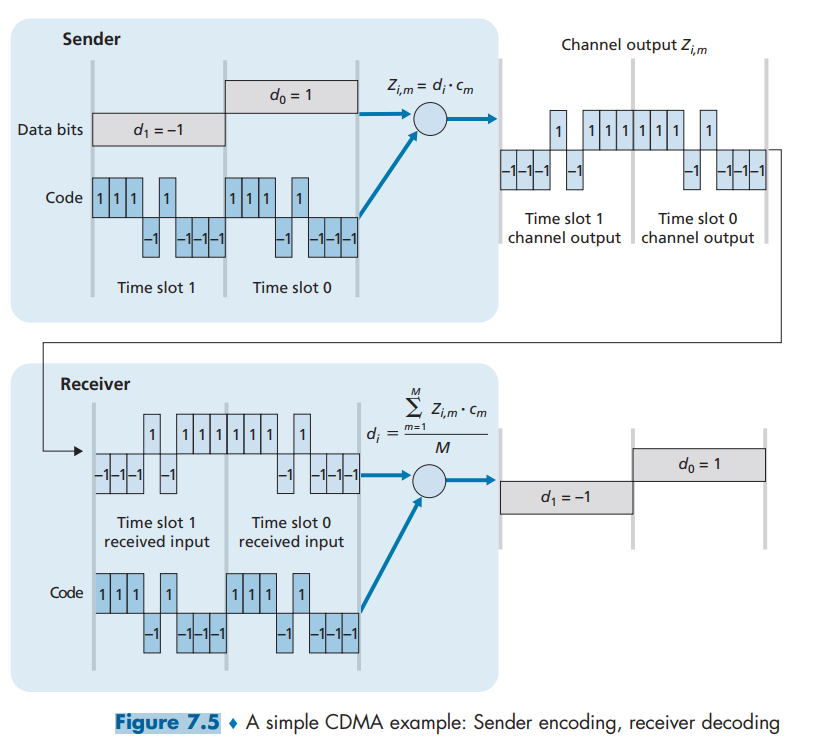
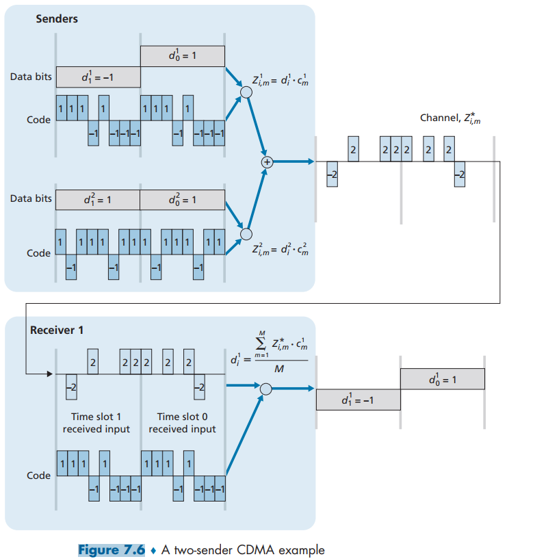
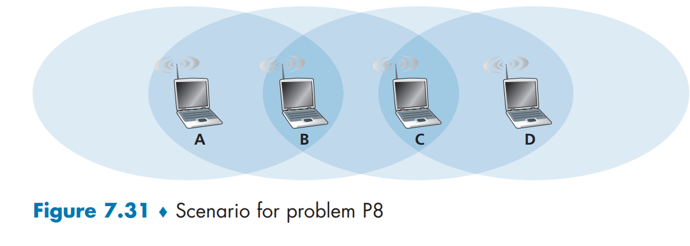

# PROBLEMS
I decide to work on problems which I found interesting and challenging. The full set of problems you can find and check on the textbook. Please buy a digital/hardcover to support the teachers. This solution is for educational purpose only, it's not correct 100% and should be double-checked with your teachers/peers. 

## SOLUTIONS 


P1. Consider the single-sender CDMA example in Figure 7.5. What would be the
sender’s output (for the 2 data bits shown) if the sender’s CDMA code were
(1, 1, -1, 1, 1, -1, -1, 1)?
```sh
Channel output for: 
d1 = (-1, -1, 1, -1, -1, 1, 1, -1)
d0 = (1, 1, -1, 1, 1, -1, -1, 1)
```



P2. Consider sender 2 in Figure 7.6. What is the sender’s output to the channel
(before it is added to the signal from sender 1), Z^2 i,m?
```sh
d^1 1 = (-1, -1, -1, 1, -1, 1, 1, 1)
d^1 0 = (1, 1, 1, -1, 1, -1, -1, -1)
```

P3. After selecting the AP with which to associate, a wireless host sends an association request frame to the AP, and the AP responds with an association response frame. Once associated with an AP, the host will want to join the subnet (in the IP addressing sense of Section 4.4.2) to which the AP belongs. What does the host do next?
```sh
Host sends a DHCP discover message to locate a DHCP server on the network (broadcasts to all the device) 
 -> DHCP offer from server include available IP address and other network config (subnet mask, default gateway, DNS servers) 
  -> DHCP request from host including that accept the IP address and network config 
   ->  DHCP ACK from server confirming that the IP address assignment and providing the final network config details 
    -> IP configuration in host 
     -> ARP request from host to check if any other device on the network is using the same IP address 
      -> Network communication  
```

P5. Suppose there are two ISPs providing WiFi access in a particular café, with each ISP operating its own AP and having its own IP address block.

a. Further suppose that by accident, each ISP has configured its AP to operate over channel 11. Will the 802.11 protocol completely break down in this situation? Discuss what happens when two stations, each associated with a different ISP, attempt to transmit at the same time.
```sh
No, it does not completely breakdown but can cause collision, increase latency and reduce throughput. 
```
b. Now suppose that one AP operates over channel 1 and the other over channel 11. How do your answers change?
```sh
Fine 
```


P8. Consider the scenario shown in Figure 7.31, in which there are four wireless nodes, A, B, C, and D. The radio coverage of the four nodes is shown via the shaded ovals; all nodes share the same frequency. 

When A transmits, it can only be heard/received by B; when B transmits, both A and C can hear/ receive from B; when C transmits, both B and D can hear/receive from C; when D transmits, only C can hear/receive from D. Suppose now that each node has an infinite supply of messages that it wants to send to each of the other nodes. If a message’s destination is not an immediate neighbor, then the message must be relayed. 

For example, if A wants to send to D, a message from A must first be sent to B, which then sends the message to C, which then sends the message to D. Time is slotted, with a message transmission time taking exactly one time slot, e.g., as in slotted Aloha. During a slot, a node can do one of the following: (i) send a message, (ii) receive a message (if exactly one message is being sent to it), (iii) remain silent. As always, if a node hears two or more simultaneous transmissions, a collision occurs and none of the transmitted messages are received successfully. You can assume here that there are no bit-level errors, and thus if exactly one message is sent, it will be received correctly by those within the transmission radius of the sender.

a. Suppose now that an omniscient controller (i.e., a controller that knows the state of every node in the network) can command each node to do whatever it (the omniscient controller) wishes, that is, to send a message, to receive a message, or to remain silent. Given this omniscient controller, what is the maximum rate at which a data message can be transferred from C to A, given that there are no other messages between any other source/destination pairs?
```sh
The time to send message from one node to its neighbor is 1 message per 2 time slot -> 0.5 messages per time slot, then to send from C to A it would take 2T (from C to B then from B to A)
```

b. Suppose now that A sends messages to B, and D sends messages to C. What is the combined maximum rate at which data messages can flow from A to B and from D to C?
```sh
2 messages on 1 time slot since A can send messages to B and D can send messages to C without collision due to the range are outside between both communication
```

c. Suppose now that A sends messages to B, and C sends messages to D. What is the combined maximum rate at which data messages can flow from A to B and from C to D?
```sh
1 message on each time slot -> 2 messages on 2 time slots -> 1 message per time slot. 
```

P10. Consider the following idealized LTE scenario. The downstream channel (see Figure 7.22) is slotted in time, across F frequencies. There are four nodes, A, B, C, and D, reachable from the base station at rates of 10 Mbps, 5 Mbps, 2.5 Mbps, and 1 Mbps, respectively, on the downstream channel. 

These rates assume that the base station utilizes all time slots available on all F frequencies to send to just one station. The base station has an infinite amount of data to send to each of the nodes, and can send to any one of these four nodes using any of the F frequencies during any time slot in the downstream sub-frame.


a. What is the maximum rate at which the base station can send to the nodes, assuming it can send to any node it chooses during each time slot? Is your solution fair? Explain and define what you mean by “fair.”
```sh
Total Max Rate = 10 Mbps + 5 + 2.5 + 1 = 18.5 Mbps -> where the base station can send data to the nodes. 

Maybe time or proportional time based on data rate? 
```
b. If there is a fairness requirement that each node must receive an equal amount of data during each one second interval, what is the average transmission rate by the base station (to all nodes) during the downstream sub-frame? Explain how you arrived at your answer.
```sh
Each node needs to wait 2 times, so the average tranmission would be 2x for each. 
```
c. Suppose that the fairness criterion is that any node can receive at most twice as much data as any other node during the sub-frame. What is the average transmission rate by the base station (to all nodes) during the subframe? Explain how you arrived at your answer.
```sh
N/A
```

